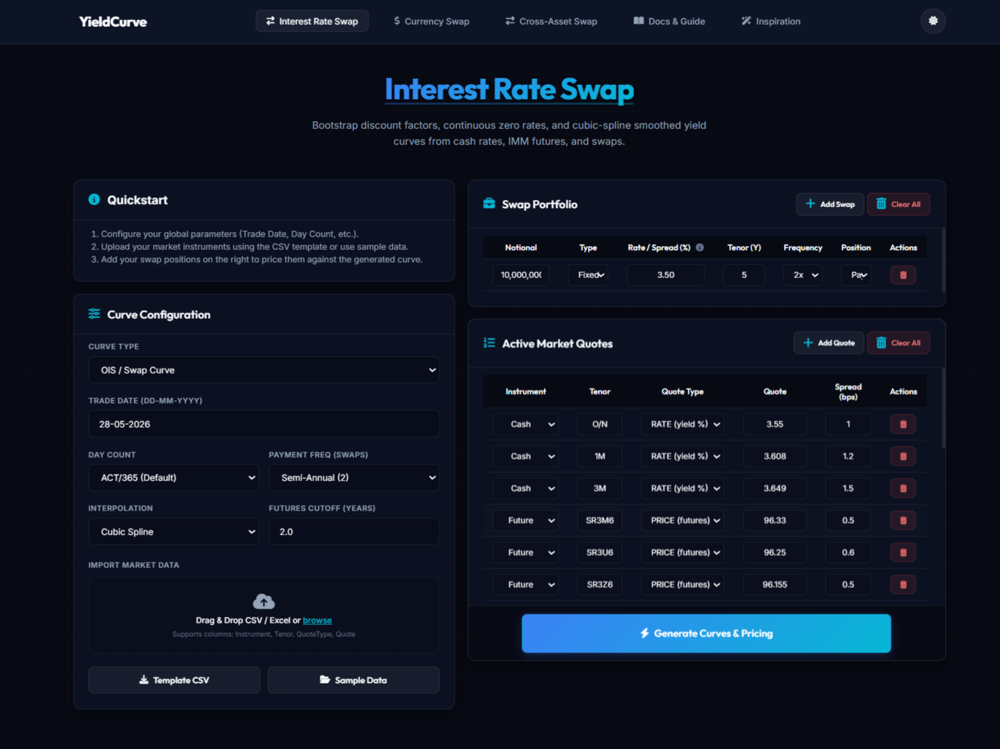
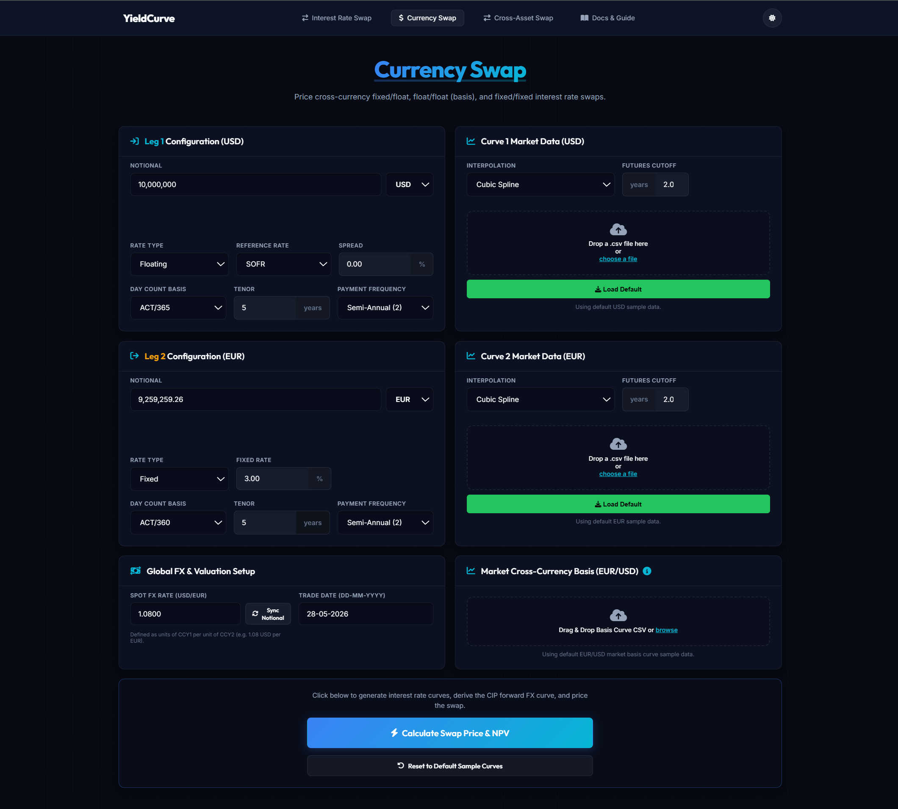
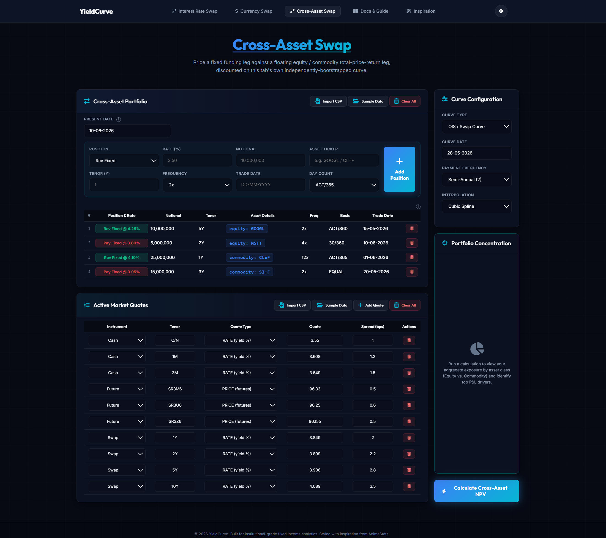
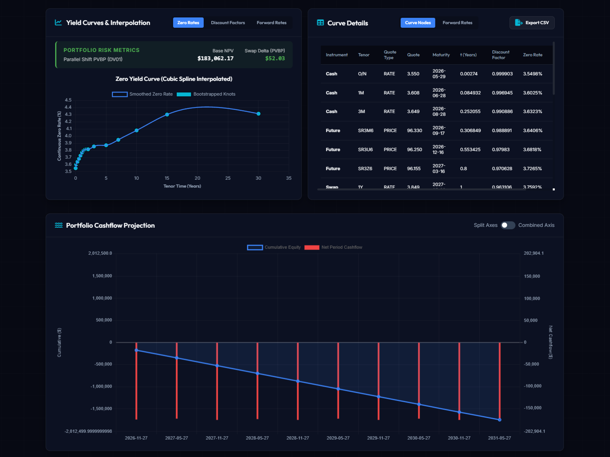
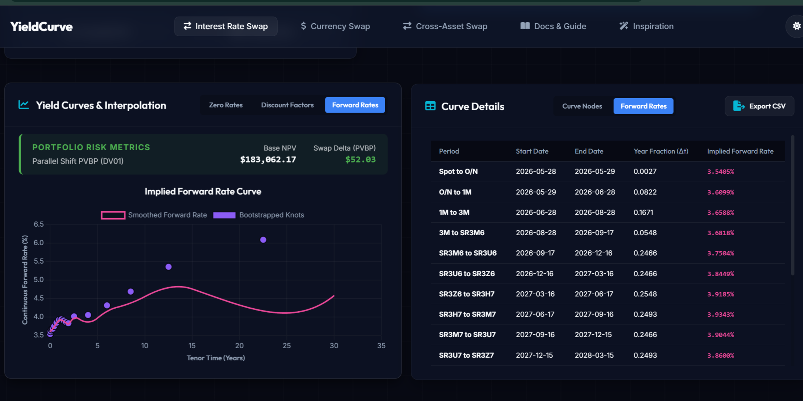
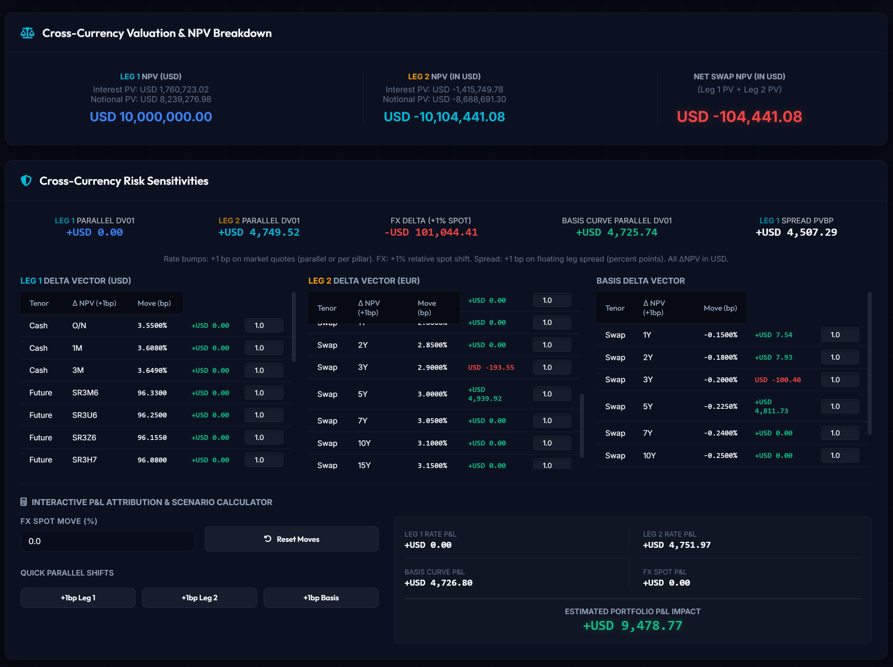
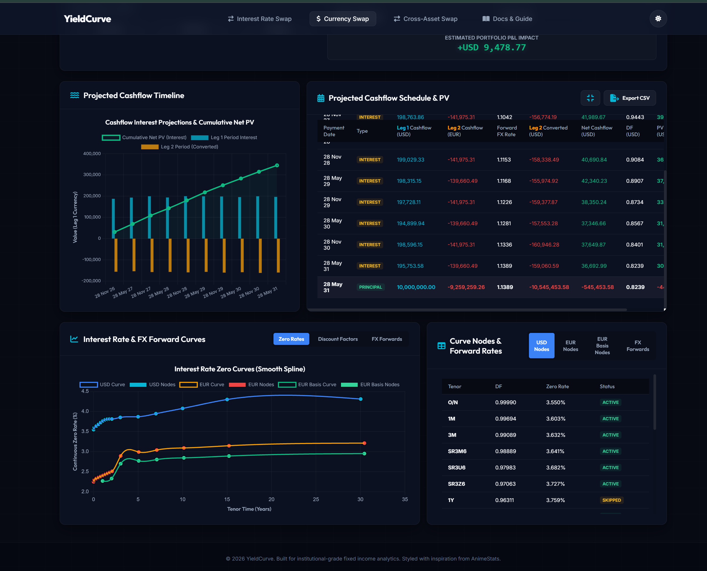
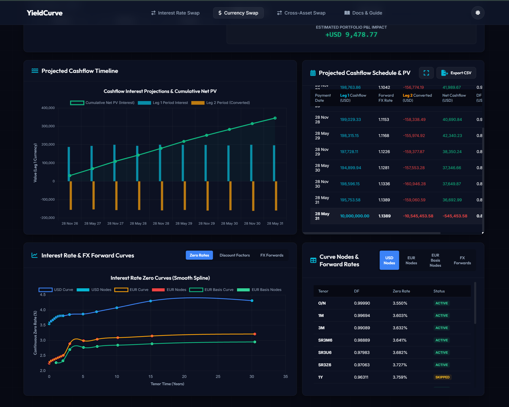
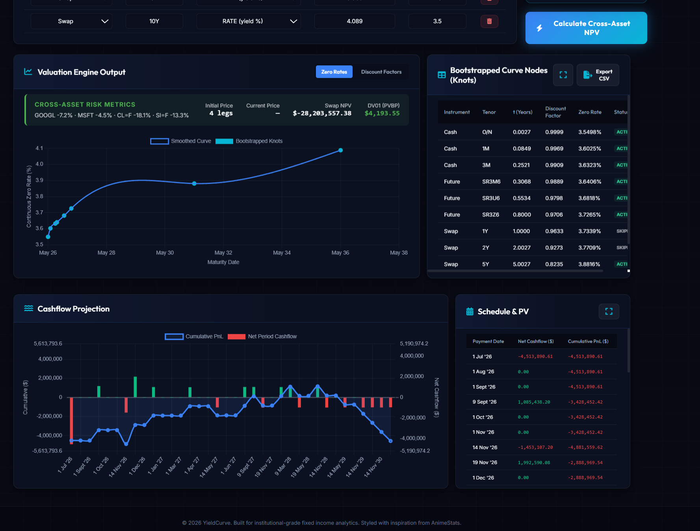

- # SwapCalc

  ### Interest Rate, Currency & Cross-Asset Swap Calculator

  A web app that prices interest rate, cross-currency, and cross-asset swaps by bootstrapping a discount curve straight from observed cash, futures, and swap quotes — then using that curve to project NPV, risk (DV01/PVBP), and a full payment-by-payment cashflow schedule for a portfolio of swap positions.

  Built using Python (Flask) and plain HTML/JS/CSS, with a strictly decoupled object-oriented backend. This is an ongoing collaborative project to actually understand how a derivative gets priced, by building the pricing engine ourselves instead of trusting a black box.

  ### <br>***Contents Page***
  - [Showcase](#showcase)
  - [What is a Swap?](#what-is-a-swap)
  - [The Key Insight: Every Tab Bootstraps Its Own Curve](#the-key-insight-every-tab-bootstraps-its-own-curve)
  - [User Guide](#user-guide)
    - [Installation](#installation)
    - [Tab 1: Interest Rate Swap](#tab-1-interest-rate-swap)
    - [Tab 2: Currency Swap](#tab-2-currency-swap)
    - [Tab 3: Cross-Asset Swap](#tab-3-cross-asset-swap)
  - [Planned Updates](# 🚀 Planned Updates)
  - [Documentation & Guides](#documentation--guides)
  - [Acknowledgments & References](#acknowledgments--references)
  - [Contributors](#contributors)

  <br>

  ## Showcase

  
  *Interest Rate Swap — set your curve, add swap positions, and price them against a cubic-spline-interpolated yield curve.*

  
  *Currency Swap — price a USD/EUR cross-currency swap using Covered Interest Parity to derive the forward FX curve.*

  
  *Cross-Asset Swap — price a fixed funding leg against floating equity/commodity total-return legs.*

  ---

  ## What is a Swap?

  A swap is a contract where two parties exchange interest payments on the same notional — typically, one side pays a fixed rate and the other pays a floating rate that resets against a market index. The point isn't speculation (well, not *only*); it's risk management. If you're exposed to a floating rate and you're worried it might spike, a swap lets you lock in a fixed rate instead, trading away upside for certainty.

  To actually price one, you need to project where that floating index is likely to sit at every future payment date. This calculator does that by **bootstrapping** a discount curve out of currently observed market quotes — short-term cash rates, mid-curve futures, and longer-tenor par swap rates — and interpolating smoothly between them. Every NPV, every cashflow, and every risk number in this app falls out of that one curve.

  **Core attributes of a swap contract:**

  | Attribute              | What it means                                                |
  | :--------------------- | :----------------------------------------------------------- |
  | **Notional Principal** | The baseline amount interest is calculated on (usually never actually exchanged, except in currency swaps). |
  | **Pay / Receive Leg**  | Each side is either fixed (locked-in rate) or floating (resets against a market index). |
  | **Trade Date**         | The day the swap is struck and starts accruing.              |
  | **Tenor**              | How long until the swap matures.                             |
  | **Day Count Basis**    | The convention (e.g. ACT/360, ACT/365, 30/360) used to convert calendar days into accrued interest. |
  | **Payment Frequency**  | How many times a year cashflows are exchanged (e.g. semi-annual = 2x). |

  ## The Key Insight: Hedging Risk with Swaps

  Think of a swap as like locking in a fixed price when you expect spot pricing to become extremely volatile.

  In finance, a swap is an agreement between two parties to exchange cash flows. Typically, one party pays a **fixed interest rate** while receiving a **floating interest rate** (which changes based on market indices like SOFR).

  * **Why do this?** If you have a loan with a floating rate of 4.6% and your budget breaks if it goes above 6%, you can enter a swap to pay a fixed 5% instead. You give up the benefit of rates dropping, but you mathematically eliminate the risk of rates spiking.
  * **How does the app help?** YieldCurve takes current market data to project what that floating rate will be in the future. It maps out exactly when you will pay or receive money (Schedule & PV) and calculates the total current worth of the contract (NPV) so you know exactly what your risk exposure is.

  ## Component Map

  | Layer             | Responsibility                                               |
  | :---------------- | :----------------------------------------------------------- |
  | **`src/app.py`**  | Flask server acting as the bridge. Handles incoming API requests from the frontend and routes them to the quant engine. |
  | **`src/main.py`** | The core quant engine. Can be run entirely via the CLI to calculate swap NPVs and use `matplotlib` to render curve outputs locally. |
  | **Frontend UI**   | HTML/JS/CSS dashboards inspired heavily by AnimeStats. Handles the dynamic layout, user input, and chart rendering. |

  # User Guide

  ## ⚙️ Installation & Setup

  1. Clone the repository: `git clone https://github.com/podledges/Swap-Calculator`

  2. Create and activate a Python environment (venv or Conda).

  3. Install the packages:

     ```bash
     pip install -r requirements.txt
     ```

  4. Start the Flask server:

     ```bash
     python src/app.py
     ```

  5. Open `http://127.0.0.1:5000` in your browser.

  If you just want to run the quant engine in the command line without the UI, run `python src/main.py`, which calculates swap NPVs and plots the curves with matplotlib.

  **Deployment:** configured to run on Render via `render.yaml` and `Procfile`, using Gunicorn.

  ---

  ### Tab 1: Interest Rate Swap

  **Scenario:** say you've taken on a $10,000,000, 5-year loan that resets every six months against a floating index currently sitting around 3.55%. That's fine today, but if rates spike, you're exposed. So you enter a **Pay-Fixed swap**: you pay a fixed rate and receive the floating leg, converting an unpredictable floating cost into a locked-in fixed one.

  

  **Setting it up:**

  1. **Curve Configuration** (left panel) — set your Trade Date, Day Count, Payment Frequency, and interpolation method. This governs how the curve is built and how every leg accrues.
  2. **Swap Portfolio** (top right) — add your position(s): Notional, Type (Fixed/Floating), Rate/Spread, Tenor, Frequency, and whether you're Paying or Receiving. You can stack multiple swaps here.
  3. **Active Market Quotes** (bottom right) — pre-loaded cash, futures (SR3M6, SR3U6...), and swap quotes. This is the actual market data the curve gets bootstrapped from.
  4. Hit **Generate Curves & Pricing**.

  **Reading the output:**

  

  - **Portfolio Risk Metrics** (top left): Base NPV and Swap Delta (PVBP). A positive Base NPV means the trade is currently in your favor given today's curve — e.g. the market is implying floating rates will sit somewhat above the fixed rate you locked in. PVBP/DV01 tells you how much that NPV moves for a 1bp parallel shift in rates — your raw interest-rate risk.
  - **Zero Yield Curve** chart: the bootstrapped discount curve, shown as discrete knots (one per quoted instrument) smoothed by a cubic spline. **Curve Details**, on the right, lists every instrument behind that curve along with its discount factor and zero rate.
  - **Portfolio Cashflow Projection** (bottom): this is the part that turns NPV from an abstract number into something you can actually plan around. The bars show the **net cashflow exchanged at each payment date** — what literally hits your account every six months — and the line tracks the **cumulative running total** over the life of the trade.

  

  - Switching **Curve Details / Yield Curves** to **Forward Rates** (shown above) shows the implied forward rate between each pair of curve pillars — this is exactly the rate your floating leg is expected to reset to once that future period arrives.

  ---

  ### Tab 2: Currency Swap

  **Scenario:** your firm needs USD funding, but most of your revenue and collateral sits in EUR. You raise EUR at a fixed rate and swap it into floating-rate USD, exchanging principal at the start and (in reverse) at maturity, at the prevailing spot FX rate. This is a classic cross-currency swap, and it's actually pricing two things at once: an interest-rate trade *and* an FX trade.

  

  **Setting it up:**

  1. **Leg 1 Configuration (USD)** and **Leg 2 Configuration (EUR)** — each leg gets its own notional, rate type (fixed/floating), reference rate, day count, tenor, and frequency. The **Sync Notional** toggle keeps the two notionals FX-consistent using the spot rate.
  2. **Curve 1 / Curve 2 Market Data** — each leg bootstraps its own currency-specific curve (this is the per-tab independence mentioned above, applied *within* a single tab).
  3. **Global FX & Valuation Setup** — Spot FX Rate and Trade Date.
  4. **Market Cross-Currency Basis** — the EUR/USD basis curve, which captures the extra premium/discount for swapping between the two currencies beyond plain interest-rate differentials.
  5. Hit **Calculate Swap Price & NPV**.

  **Reading the output:**

  

  - **Leg 1 / Leg 2 NPV**: each leg's present value, converted into a common currency (USD here) so they can be netted directly.
  - **Net Swap NPV**: Leg 1 PV + Leg 2 PV. A small negative number here (relative to the size of the notionals) is normal — it usually reflects the cross-currency basis and FX timing, not a mispriced trade.
  - **Risk Sensitivities**: per-leg parallel DV01, **FX Delta** (sensitivity to a 1% spot move), and Basis Curve DV01. Comparing the FX Delta to the per-leg DV01s tells you how much of your total risk on this trade is actually *currency* risk versus *interest-rate* risk — on a cross-currency swap, it's often the FX leg that dominates.
  - The **Interactive P&L Attribution & Scenario Calculator** lets you bump FX spot or apply quick parallel shifts (+1bp Leg 1 / Leg 2 / Basis) and see the live portfolio P&L impact, broken out by source.

  

  - **Projected Cashflow Timeline** and **Projected Cashflow Schedule & PV** show, payment by payment: Leg 1's cashflow (USD), Leg 2's cashflow (EUR), the **Forward FX Rate** used to convert Leg 2 into USD for that date, and the resulting **Net Cashflow**. The final row is the principal exchange at maturity — the big one.

  > **Tip — the resize button:** look for the small expand icon (⛶) in the top-right corner of panels like *Projected Cashflow Schedule & PV*. Click it to pop that panel out to full width. It's easy to miss, but genuinely useful once a schedule runs 15–20+ payment dates and the default side-by-side layout starts feeling cramped. Compare the standard compact view above (`7.png`) against the same panel expanded full-width below (`8.png`):

  

  ---

  ### Tab 3: Cross-Asset Swap

  **Scenario:** you're running a structured position that pays or receives the total return of a stock or commodity against a fixed funding rate — say, you want exposure to GOOGL without holding the shares outright, or you're hedging an existing equity position with a fixed-rate funding leg. This tab is built for stacking several of these exposures into one portfolio at once.

  

  **Setting it up:**

  1. **Cross-Asset Portfolio** — add each leg individually: Position (Rcv/Pay Fixed), Rate, Notional, **Asset Ticker** (any equity ticker like `GOOGL`, or commodity future like `CL=F`), Tenor, Frequency, Trade Date, Day Count. The example portfolio above mixes equities (GOOGL, MSFT) with commodities (crude oil `CL=F`, silver `SI=F`) — each leg is fully independent, so you can size, tenor, and convention each one separately.
  2. **Curve Configuration** — this tab bootstraps its own discount curve, separate from the Interest Rate and Currency tabs.
  3. **Active Market Quotes** — feeds the OIS/swap curve used to discount all the legs.
  4. Hit **Calculate Cross-Asset NPV**.

  **Reading the output:**

  

  - **Cross-Asset Risk Metrics** bar: shows the % price move of each underlying ticker since the trade date (e.g. GOOGL -7.2%, CL=F -18.1%), alongside the aggregate **Swap NPV** and **DV01**. Because notionals here can be large relative to typical equity/commodity moves, the price-return legs usually dominate the NPV far more than the discount-rate sensitivity does.
  - The zero curve, **Bootstrapped Curve Nodes**, and **Cashflow Projection** (cumulative P&L line + net period cashflow bars) work the same way as the other tabs, just applied to total-return legs instead of fixed/floating interest legs.
  - **Schedule & PV** also has the expand icon (⛶) in its corner — same resize behavior as the Currency tab, useful here too since multi-leg portfolios generate long combined schedules.
  - **Portfolio Concentration** (right panel) is currently a placeholder until you run a calculation — it's there to eventually break down your aggregate exposure by asset class (equity vs. commodity) and surface your top P&L drivers.

  ---
  ## ⚠️ Known Issues
  - **Inconsistent naming** between swap calc and 'yield curve'

  - ***Minor* visual bugs** can *sometimes* be seen in the cross-asset tab.

    <br> 

  ## 🚀 Planned Updates

  A few things we're poking at — not promises, just where our heads are at right now:

  - **Master Portfolio tab** — we're exploring a unified view where you define each swap position once, tag it with the calculator type it should route through (Interest Rate, Currency, or Cross-Asset), and it links back to that tab's own pricing engine. The goal is one aggregated NPV/DV01 across your whole book instead of re-running three tabs separately. Still conceptual, no firm timeline.
  - **Expanded Cross-Asset calculations** — more quantitative metrics for the Cross-Asset tab beyond NPV and DV01 (thinking sensitivities beyond a flat parallel shift). Nothing locked in yet.
  - **Cross-Asset UI overhaul** — bringing the visual polish of this tab up to where the Interest Rate and Currency tabs already are.
  - **More swap types** — there's more on the radar than what's listed here. We'll see what actually ships.

  ---

  ## Documentation & Guides

  - [Architecture Overview](./docs/architecture.md)
  - [API Reference](./docs/api.md)
  - **Math Docs**: A docs page and a LaTeX file (`financial-math.tex`) explaining the math formulas behind the curve bootstrapping and pricing.

  ## Acknowledgments & References

  **References**

  * **Miron, Paul. *Pricing and Hedging Swaps*.** This book served as our primary educational resource and reference guide. It provided the foundational knowledge on pricing methods, swap valuation, and the underlying mathematics that power the core logic of this calculator.

  **Inspiration**

  * **[AnimeStats](https://www.animestats.tf/)**
    This site served as our main inspiration for the user interface. We referenced its layout and visual design heavily when structuring the frontend of our application.

  <br>

  ## Contributors

  - [@podledges](https://github.com/podledges) (Ayden) - Developer
  - [@Iota113](https://github.com/Iota113) (Henry) - Developer
